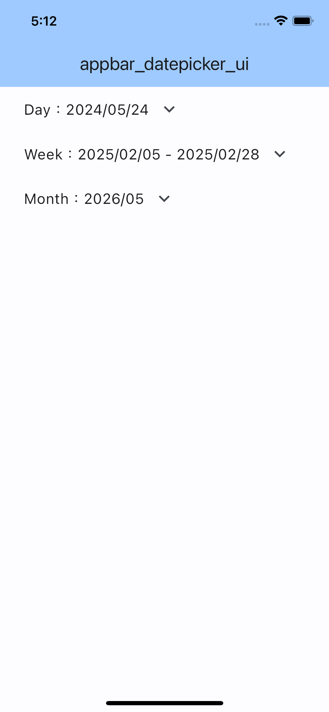
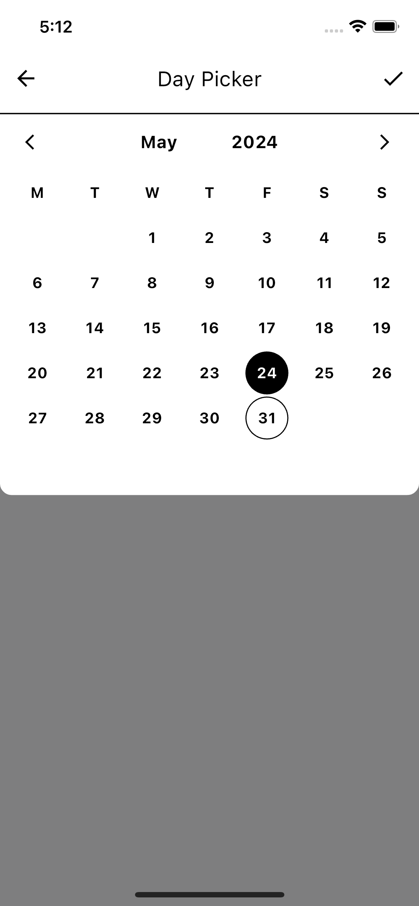
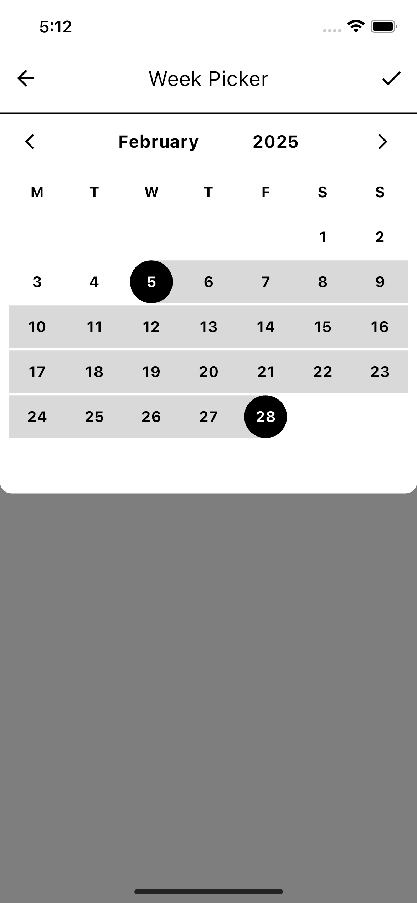
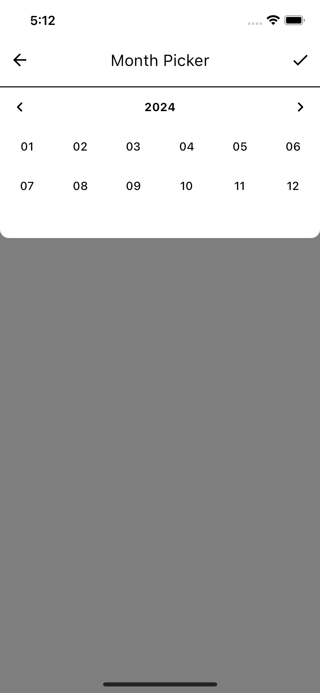

# flutter_appbar_datepicker

A new Flutter package includes a day picker, week picker, and month picker.

<!--  -->

<!--  -->


## Getting started

Include short and useful examples for package users. For longer examples, please see the `/example` folder.

### Day Picker

<!--  -->

<!--  -->


day_picker.dart

```dart
DateTime daySelected = DateTime.now();
String dayFormatted = DateFormat('yyyy/MM/dd').format(DateTime.now());

Text(
  'Day：$dayFormatted',
  style: TextStyle(
    fontSize: 16.sp,
  ),
),

onPressed: () async {
  CustomDayPickerDialog(
    context: context,
    primaryColor: Colors.black,
    secondaryColor: Colors.white,
    initialDate: daySelected,
    onConfirm: (DateTime newSelectedDate) {
      setState(() {
        daySelected = newSelectedDate;
        dayFormatted = DateFormat('yyyy/MM/dd')
            .format(newSelectedDate);
      });
    },
  ).show();
},
```

### Week Picker

<!--  -->

<!--  -->


week_picker.dart

```dart
List<DateTime?> _dateRangePickerValue = [
  DateTime.now(),
  DateTime.now().add(const Duration(days: 6)),
];
String formatDate(List<DateTime?> dateRange) {
  final startDate = DateFormat('yyyy/MM/dd').format(dateRange[0]!);
  final endDate = DateFormat('yyyy/MM/dd').format(dateRange[1]!);
  return '$startDate - $endDate';
}

Text(
  'Week：${formatDate(_dateRangePickerValue)}',
  style: TextStyle(
    fontSize: 16.sp,
  ),
),

IconButton(
  icon: Icon(
    Icons.keyboard_arrow_down_outlined,
    size: 24.sp,
  ),
  onPressed: () async {
    CustomWeekPickerDialog(
      context: context,
      primaryColor: Colors.black,
      secondaryColor: Colors.white,
      startDate: _dateRangePickerValue[0]!,
      endDate: _dateRangePickerValue[1]!,
      onConfirm: (DateTime startDate, DateTime endDate) {
        setState(() {
          _dateRangePickerValue = [
            startDate,
            endDate,
          ];
        });
      },
    ).show();
  },
),
```

### Month Picker

<!--  -->

<!--  -->


month_picker.dart

```dart
DateTime monthSelected = DateTime.now();
String monthFormatted = DateFormat('yyyy/MM').format(DateTime.now());

Text(
  'Month：$monthFormatted',
  style: TextStyle(
    fontSize: 16.sp,
  ),
),

onPressed: () async {
  CustomMonthPickerDialog(
    context: context,
    primaryColor: Colors.black,
    secondaryColor: Colors.white,
    initialDate: monthSelected,
    onConfirm: (DateTime newSelectedDate) {
      setState(() {
        monthSelected = newSelectedDate;
        monthFormatted = DateFormat('yyyy/MM').format(newSelectedDate);
      });
    },
  ).show();
},
```

## Dentails

### `day_picker.dart`

- **`daySelected`**  
  Stores the currently selected date.

  **Type:** `DateTime`

  **Default:** `DateTime.now()`

- **`dayFormatted`**  
  Stores the currently selected date formatted as 'yyyy/MM/dd'.

  **Type:** `String`

  **Default:** `DateFormat('yyyy/MM/dd').format(DateTime.now())`

### `week_picker.dart`

- **`_dateRangePickerValue`**

  Stores an array of two `DateTime` objects representing the start and end of a date range.

  **Type:** `List<DateTime?>`

  **Default:** `[DateTime.now(), DateTime.now().add(const Duration(days: 6))]`

- **`formatDate`**

  Formats the date range from the `_dateRangePickerValue` list into a string showing the start and end dates.

  **Type:** `String Function(List<DateTime?> dateRange)`

  **Returns:** A string formatted as 'yyyy/MM/dd - yyyy/MM/dd' representing the start and end dates.

### `month_picker.dart`

- **`monthSelected`**

  Stores the currently selected date.

  **Type:** `DateTime`

  **Default:** `DateTime.now()`

- **`monthFormatted`**

  Stores the currently selected date formatted as 'yyyy/MM'.

  **Type:** `String`

  **Default:** `DateFormat('yyyy/MM').format(DateTime.now())`
